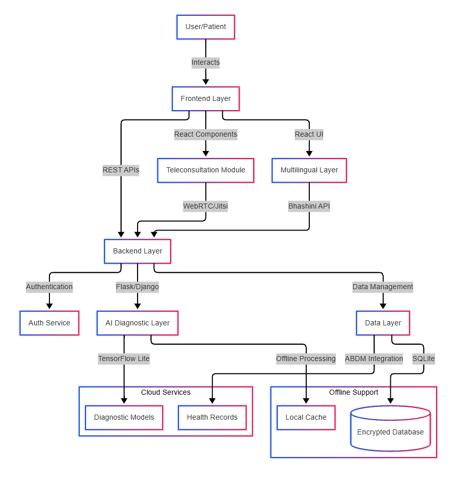
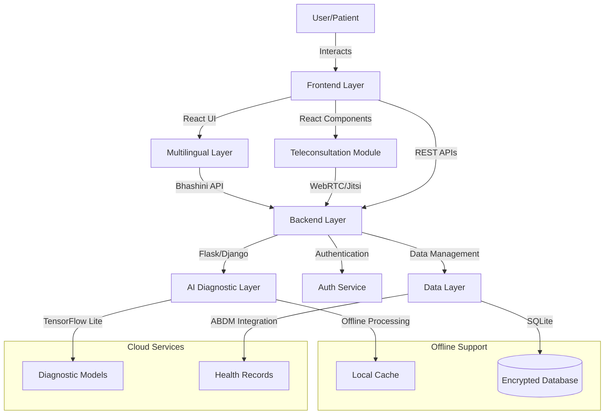

# AI-Powered Health Kiosks: Transforming CSCs for Rural India 🌱💻


Welcome to our hackathon project! This repository contains the source code and documentation for an innovative solution aimed at revolutionizing rural healthcare in India by leveraging AI and existing infrastructure.

## Hackathon Info 🏆
- **Event:** ByteVerse 7.0 Hackathon  
- **Theme:** Healthcare and Medical  
- **Tracks:** Web Development, Artificial Intelligence  
- **Team Name:** Pseudonerds  
- **Submission Date:** April 13, 2025  
- **GitHub Repository:** [https://github.com/Rudra00codes/Pseudonerds](https://github.com/Rudra00codes/Pseudonerds)

- **Prototype Video:** [Link to Video](https://www.loom.com/share/3e3edf3f9a044c1bbb6fd9f261e236a7?sid=9f88cc03-f5c6-46bd-825a-6d42f989d59c) 

## Problem Statement 🤔
Rural India faces a dual challenge:  
- **Underutilized CSCs:** Approximately 60% of India’s 550,000 Common Service Centers (CSCs) lack consistent public engagement, limiting their potential for health services.
- **Healthcare Access Gap:** An estimated 70% of rural populations lack affordable diagnostic services due to infrastructure and cost barriers (NSSO 2023 estimate, per project report).  

This healthcare gap results in delayed diagnoses, high medical costs, and improper treatment in rural areas - challenges our AI-powered health kiosks are designed to solve through accessible diagnostic services at CSCs.

---

## Our Solution 🚀
#### We propose transforming existing CSC computers into **AI-Powered Health Kiosks** to bridge rural healthcare gaps. Our solution includes:  

- **AI Diagnostics:** Immediate symptom-based diagnostics using TensorFlow Lite, even offline.  
- **Multilingual Support:** 10+ Indian languages via Bhashini API for inclusivity.  
- **Teleconsultation:** Real-time audio/video consultations with remote doctors using WebRTC/Jitsi Meet.  
- **ABDM Integration:** Secure health record linkage with Ayushman Bharat Digital Mission (ABDM).  
- **Offline-First Design:** Syncs data when connectivity resumes, ideal for remote areas.  

#### This zero-cost, reusable infrastructure approach empowers rural communities with accessible healthcare.

---

## System Architecture 🏗️
#### Our system follows a modular, layered architecture optimized for CSC deployment.



<details>
<summary>Click to see the mermaid architecture view</summary>


</details>

---


## Component Relationships 🔗

<details>
<summary>Click to expand</summary>

### Core Layers 🏗️
- **Presentation Layer:** 🖥️ Handles UI interactions (React-based forms, dashboards)
- **Application Layer:** ⚙️ Manages business logic (user auth, AI processing) via Flask/Django
- **AI Layer:** 🤖 Runs TensorFlow Lite models for diagnostics
- **Data Access Layer:** 🔐 Interfaces with encrypted SQLite database
- **Data Storage Layer:** 💾 Stores user data, diagnoses, and health info securely

### Detailed Layer Interactions 🔄
- **User → Presentation Layer** 👤
  - Users input symptoms or access teleconsultation via a responsive UI
- **Presentation → Application Layer** 📡
  - RESTful APIs handle requests for AI processing or data retrieval
- **Application → AI Layer** 🧠
  - Sends preprocessed data to TensorFlow Lite for inference
- **Application → Data Access Layer** 🔑
  - Manages CRUD operations with SQLAlchemy ORM
- **Data Access → Data Storage** 🗄️
  - Encrypts and stores data with AES-256, compliant with ABDM
- **Feedback Loop** 🔄
  - AI layer updates models with new data when online, enhancing accuracy

</details>

## Technology Stack 💾

- **Frontend:** 🎨 React (for dynamic, responsive UI)
- **Backend:** 🐍 Python (Flask/Django) with RESTful APIs
- **AI:** 🤖 TensorFlow Lite (optimized for low-resource devices)
- **Multilingual:** 🗣️ Bhashini API (supports 10+ Indian languages)
- **Teleconsultation:** 📞 WebRTC/Jitsi Meet (open-source video/audio)
- **Database:** 🔒 ABDM-compliant SQLite with AES-256 encryption
- **Dev Tools:** 🛠️ Git, 🐳 Docker (for containerization), ✉️ Postman (API testing)

## Getting Started 🛠️

### Installation and Setup

Clone the repository and set up the project locally:
```bash
git clone https://github.com/Rudra00codes/Pseudonerds.git
cd Pseudonerds
```

### Setup Instructions

1. **Install Backend Dependencies**
   ```bash
   pip install -r requirements.txt
   ```

2. **Run Backend Server**
   ```bash
   python app.py
   ```

3. **Install Frontend Dependencies**
   ```bash
   cd frontend
   npm install
   ```

4. **Configure Environment**

   Create a `.env` file with API keys (e.g., Bhashini, ABDM):
   ```bash
   BHASHINI_API_KEY=your_key
   ABDM_API_KEY=your_key
   ```

5. **Run Frontend Server**
   ```bash
   npm start
   ```

## Deployment Links 🌐
- **Heroku Backend:** *(to be updated post-hackathon)*
- **Vercel Frontend:** *(to be updated)*

## Features and Screenshots 📸

### Key Features ✨
- **🔐 User Authentication:** Secure login for CSC operators and patients
- **📝 Symptom Input:** Multilingual forms with validation
- **🤖 AI Diagnostics:** Real-time results with explanations
- **👨‍⚕️ Teleconsultation:** Video calls with doctors
- **📚 Health Library:** Curated preventive care content
- **📊 Analytics Dashboard:** Tracks usage and health trends

### Screenshots 🖼️
<details>
<summary>Click to View Screenshots! 📱</summary>

1. **Login Page** 🔑
2. **Symptom Input Form** 📋
3. **AI Diagnosis Results** 🔍
4. **Teleconsultation Interface** 🩺

*Note: Placeholder screenshots will be replaced with actual prototype images.*
</details>

## Future Scope 🚀
- **🧠 Continuous Learning:** Enhance AI models with real-time data for better accuracy
- **📱 Mobile App:** Develop a companion app for on-the-go access
- **🔌 IoT Integration:** Add wearable device support for vital monitoring
- **📈 Scalability:** Expand to all 550,000 CSCs with government partnerships

## Team Details 👥
- **👨‍💻 Rudra Pratap Singh** - *Lead Developer* ([@Rudra00codes](https://github.com/Rudra00codes))
- **🤖 Yugandhar Bhardwaj** - *AI Specialist* ([@yugandharb](https://github.com/yugandhar))
- **🔬 Aditya Punj** - *Healthcare Research Specialist* ([@adityapunj](https://github.com/Adityapunj639))
- **🎨 Raj Bardhan Singh** - *UI/UX Designer & Creative Lead* ([@rajbardhan](https://github.com/RAj2027))

## Acknowledgements 🙏
We extend our heartfelt gratitude to:
- **🏫 The HackSlash Club** for this amazing opportunity
- **🗣️ Bhashini** for multilingual API support
- **🏥 Ayushman Bharat Digital Mission** for health record integration
- **💻 Open-source communities** (TensorFlow, React) for tools and inspiration

## License 📜
This project is licensed under the MIT License. See the LICENSE file for details.
